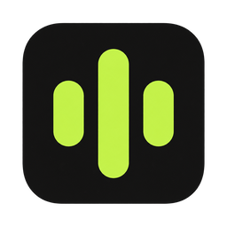
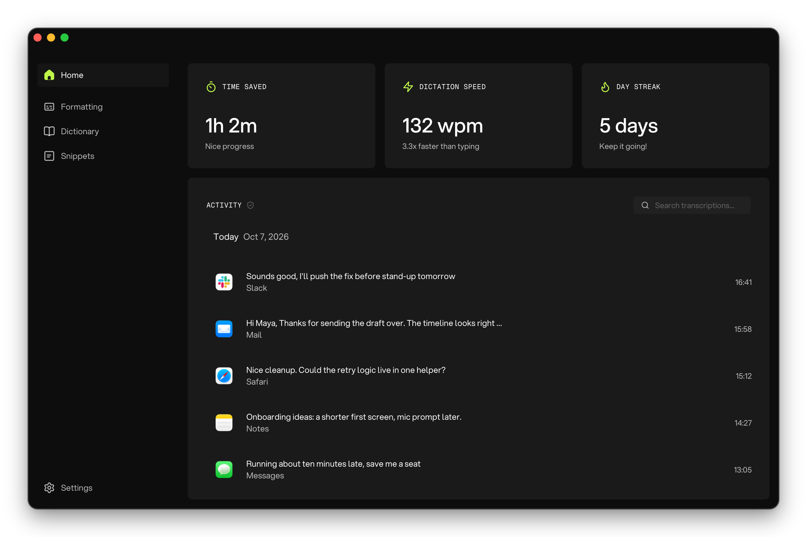
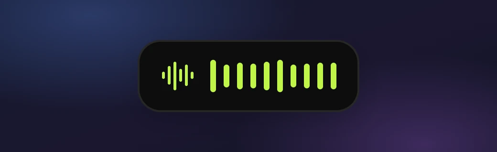
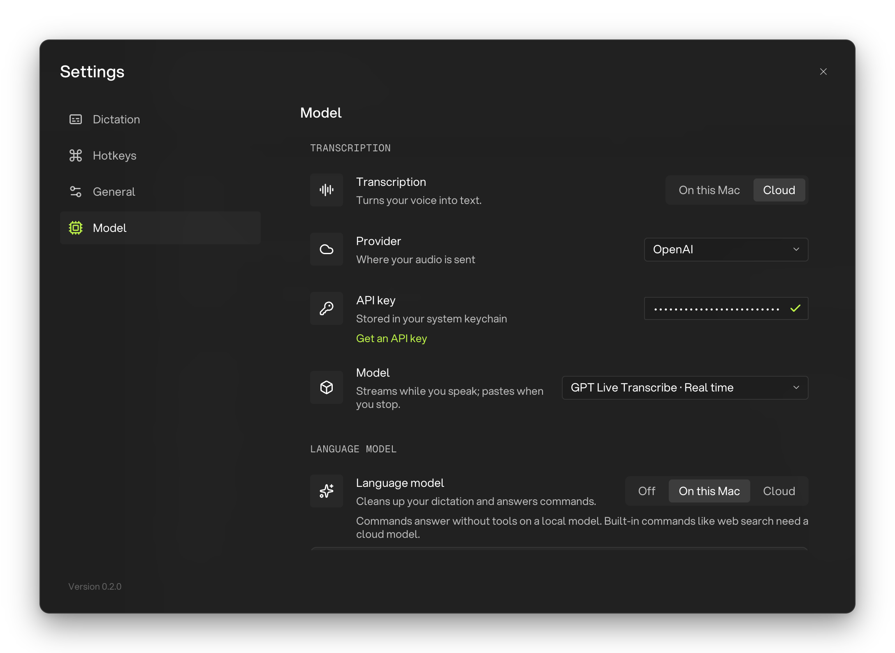
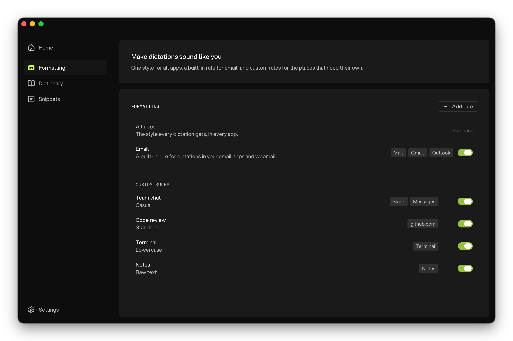

<p align="center"></p>

# OpenGlaido

**Talk instead of type.** Hold a shortcut, speak, let go. Your words appear at your cursor.

Open-source dictation for macOS, Windows 11 and Linux, inspired by [Glaido](https://glaido.com) and [VoiceInk](https://tryvoiceink.com). No subscription. Bring your own API key, or run a model on your Mac.

**[Download the latest release](https://github.com/Legoless/OpenGlaido/releases/latest)** · [Website](https://openglaido.com) · [Report a problem](https://github.com/Legoless/OpenGlaido/issues)

<p align="center"><br><sub>Screenshots show demo data.</sub></p>

## Get started

### 1. Install

| Computer | Download | Requirements |
| --- | --- | --- |
| Mac | `.dmg` | Apple Silicon, macOS 11 (Big Sur) or later |
| Windows | `-setup.exe` or `.msi` | Windows 11 x64 |
| Linux | `.AppImage` or `.deb` | x64, X11, glibc 2.39+ (Ubuntu 24.04+, Debian 13+, Fedora 40+, current Arch) |

- **Mac:** drag OpenGlaido to Applications. It's signed and notarized.
- **Windows:** the installer isn't signed yet. If you see "Windows protected your PC", choose **More info › Run anyway**.
- **Linux:** `chmod +x OpenGlaido_*.AppImage` and run it, or `sudo apt install ./OpenGlaido_*_amd64.deb`.
- **Updates** are signed and install only when the app is idle with its windows closed.

### 2. Finish setting up

Home's **Finish setting up OpenGlaido** card shows what's left.

- **API key:** OpenGlaido starts out using Groq, a cloud AI service. Add your Groq API key in **Settings › Model** before you dictate, or [choose another model](#choose-a-model).
- **Mac:** allow **Accessibility** (for shortcuts and pasting) and the **microphone** when asked. Windows and Linux don't ask for permissions.
- **Mac tip:** in **System Settings › Keyboard**, set "Press globe key to" to **Do Nothing**, so fn doesn't open the emoji picker.

### 3. Dictate

| Action | Mac | Windows | Linux |
| --- | --- | --- | --- |
| **Dictate** (hold) | fn | Ctrl+Win | Ctrl+Super+G |
| **Hands-free** (press to start and stop) | fn+Space | Ctrl+Win+Shift | Ctrl+Shift+Super+G |
| **Cancel** | Esc | Esc | Esc |
| **Commands** (beta, hold) | Right Option | Left Ctrl+Left Alt | Ctrl+Super+A |
| **Commands** (beta, hands-free) | Right Option+Space | Left Ctrl+Left Alt+Shift | Ctrl+Shift+Super+A |

Change shortcuts, or turn on **Enter to stop and paste**, in **Settings › Hotkeys**.

## What happens when you dictate

<p align="center"></p>

When you stop recording, your words are cleaned up and pasted into the text field you're in.

- The **dictation bar** moves with your voice and stays up while your words are processed. It never pulls you out of the app you're typing in.
- On a Mac, its **×** cancels a hands-free recording or one that's still processing.
- Switching windows doesn't stop dictation: the text goes into whichever field you're in when it's ready. To cancel instead when you switch while recording, turn on **Cancel when focus changes** (Mac and Windows).
- OpenGlaido pastes through your clipboard, then puts back text you had copied (not images or files). Turn on **Copy to clipboard** to keep your dictation there instead.
- Dictations are saved in History, so you can retry one if something fails. Recordings with no speech are dropped.

## Choose a model

- **Transcription** turns your voice into text.
- The **language model** (on by default) fixes capitals and punctuation, removes "um" and answers Commands. Turn it **Off** to skip cleanup and Commands.

<p align="center"></p>

| | Cloud or your own server | Downloaded to your Mac |
| --- | --- | --- |
| **Transcription** | Groq (default), OpenAI, ElevenLabs, Microsoft Azure and more | Whisper, Parakeet Ultra, Qwen3-ASR, Microsoft VibeVoice ASR and more |
| **Language model** | Groq (default), OpenAI, Google Gemini, Ollama, LM Studio and more | Gemma 4 E2B (recommended), Qwen3 4B, Ministral 3 3B |

- Downloaded models are Mac only, and some need macOS 12+ or 14+. On Windows and Linux, use the cloud or a server on your own computer: Ollama or LM Studio for the language model, or **Custom** for either.
- **Custom** works with any server that speaks the OpenAI API.
- **Real time** models turn your speech into text as you talk, but paste only once you stop.

Details: [local transcription models](docs/local-transcription-models.md), [Microsoft models, including Azure setup](docs/microsoft-transcription-models.md).

## Features

<p align="center"></p>

- **Formatting:** pick a Standard, Casual or Lowercase style and, if you like, add your own instructions (up to 500 characters). **Raw text** skips AI cleanup.
- **Rules:** give an app or website its own style and instructions. The built-in **Email** rule is on by default for Gmail and Outlook.com on the web.
- **Dictionary:** add names and terms to help transcription get them right, if your model accepts hints. **Replace with** swaps in your own spelling after transcription, with any model.
- **Snippets:** say a trigger like "my email" on its own to paste saved text.
- **History:** play, copy, delete or **Retry** dictations. Search with **Cmd+K** or Ctrl+K.
- **Commands (beta, off by default):** ask out loud and get an answer in a floating window. Turn on beta features in **Settings › General**, then use the Commands shortcut or start a dictation with "Glaido, …".
- **Tools:** web search and other Commands tools need a cloud language model. Web search and deep research also need a search service: Brave, Tavily or SearXNG. You can add your own tools too, as local MCP servers (a standard way to connect tools to AI).
- **Also:** remembered microphones, 14 app languages, sounds, themes and launch at login.

## Privacy and cost

- **Cost:** you pay cloud providers directly. Models on your Mac have no per-request fees. Dictionary hints add 20% to ElevenLabs costs.
- **On your computer:** settings, history (until you delete it), dictionary, snippets and recordings. API keys go in the system keychain.
- **Sent to cloud transcription:** your recording and dictionary hints. **Real time** models send your raw audio while you're still speaking.
- **Sent to a cloud language model:** the transcript, your style and instructions. Commands also send your request, the app's name, any text you've selected (Mac) and whatever their tools look up.
- Web searches go only to your search provider. Reading a page or YouTube video fetches it from that site. Models come from Hugging Face; update checks go to GitHub.
- **Fully offline on a Mac:** pick a downloaded transcription model and set the language model to **On this Mac** or **Off**.
- No analytics or telemetry code.

## Known limitations

- No Intel Mac, Windows ARM or Linux ARM builds.
- On Windows, rules list only apps you've recently dictated into, and recognize only the Gmail and Outlook websites.
- Linux can't tell which app you're in, so it uses only the All apps style and History shows no app names.
- Linux is X11 only. On Wayland, shortcuts, pasting into Wayland apps and dictation-bar placement don't work.
- On Linux, shortcuts need a non-modifier key, **Mute system audio** does nothing yet, and API keys need a running Secret Service.

## Development Setup

- **All:** Git, [Bun](https://bun.sh/) (not Node.js or pnpm), latest stable [Rust](https://rustup.rs/).
- **macOS:** Xcode Command Line Tools, [CMake](https://cmake.org/), python3, plus [uv](https://docs.astral.sh/uv/) on Apple Silicon.
- **Windows:** native x64, Visual Studio C++ build tools, Windows SDK, WebView2, PowerShell.
- **Linux (Ubuntu 24.04):**

```bash
sudo apt-get install -y build-essential curl wget file libwebkit2gtk-4.1-dev libgtk-3-dev libayatana-appindicator3-dev librsvg2-dev patchelf libssl-dev libasound2-dev libxkbcommon-dev libdbus-1-dev pkg-config
```

```bash
git clone https://github.com/Legoless/OpenGlaido.git && cd OpenGlaido
bun install
bun run tauri dev     # development
bun run tauri build   # local, unsigned build
```

Before a pull request, run the CI checks:

```bash
bun install --frozen-lockfile && bun test scripts && bun run build && bun run check:locales
cd src-tauri && cargo clippy --locked --all-targets -- -D warnings && cargo test --locked
```

On Windows, also run `$env:RUNNER_TEMP = $env:TEMP; ./scripts/check-windows-tests.ps1` in PowerShell from the repository root.

- Releases are built and signed locally, never in CI. See [docs/releases.md](docs/releases.md).
- Architecture and rules: [AGENTS.md](AGENTS.md). Model helpers: [native-stt](native-stt/README.md), [native-vibe](native-vibe/README.md), [native-microsoft](native-microsoft/README.md).

## Contributing

- Report bugs and ideas in [GitHub Issues](https://github.com/Legoless/OpenGlaido/issues).
- Focused pull requests for code, docs or translations (`src/locales/`) are welcome.
- The app's "Search documentation" command reads this README and AGENTS.md, so keep both accurate.

## License

[MIT License](LICENSE).
